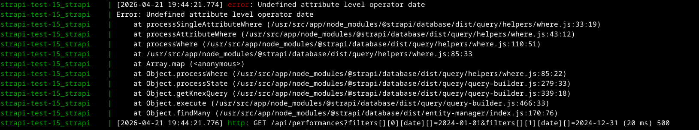

# REST API $and and $or operators don't work

The data has a `date` field which I try to query.

With this query:

`curl -g "localhost:1337/api/performances?filters[$and][0][date][$gte]=2024-01-01&filters[$and][1][date][$lte]=2024-12-31"`

I get this error:

# Steps to reproduce

1. import the data from the backup (see [Project snapshot](#project-snapshot))
2. start Strapi by running `docker compose -f docker-compose.dev.yml up`
3. run the query above

# Document Service API operators do work

[Here](./src/api/performance/controllers/test.js) I perform the same query as above via Document Service API. Run:

`curl localhost:1337/api/performances/test`

this works as intended.

# Project snapshot

I've created a backup, containing the data and configs. Here it is: `./backups/2026-03-19_01.tar`.

For restoring this snapshot, see [Importing the backup file](#importing-the-backup-file) below.

# Importing the backup file

Run:

`docker compose -f docker-compose.dev.yml run strapi npm run strapi import -- -f /usr/src/app/backups/<export file name>`

The `-f` option points to a location that's mounted from the host system.

# Running the app

`docker compose -f docker-compose.dev.yml up`

# Exporting the project data and configuration

To export, I use `strapi export` [`3`, `4`].

Because I run Strapi in a Docker Compose setup, I need to run it inside the `strapi` container. To do this, first stop (and remove) the containers if they are running (i.e., hit Ctrl + c and run `docker compose down`).

`docker compose -f docker-compose.dev.yml run strapi npm run strapi export -- --no-encrypt --no-compress -f /usr/src/app/backups/<export file name>`

The `-f` here points to the `/usr/src/app/backups` directory, which is mounted from the host `./backups`, so the backup file stays in the host filesystem.

# Refs

1. https://docs.strapi.io/cms/quick-start#step-4-set-roles--permissions
2. https://docs.strapi.io/cms/api/rest/populate-select#population
3. https://docs.strapi.io/cms/data-management/export
4. https://docs.strapi.io/cms/cli#strapi-export
5. https://docs.strapi.io/cms/api/rest/populate-select#populate-with-filtering
6. https://stackoverflow.com/questions/8333920/passing-a-url-with-brackets-to-curl
7. https://docs.strapi.io/cms/api/rest/populate-select#combining-population-with-other-operators
8. https://docs.strapi.io/cms/data-management/import